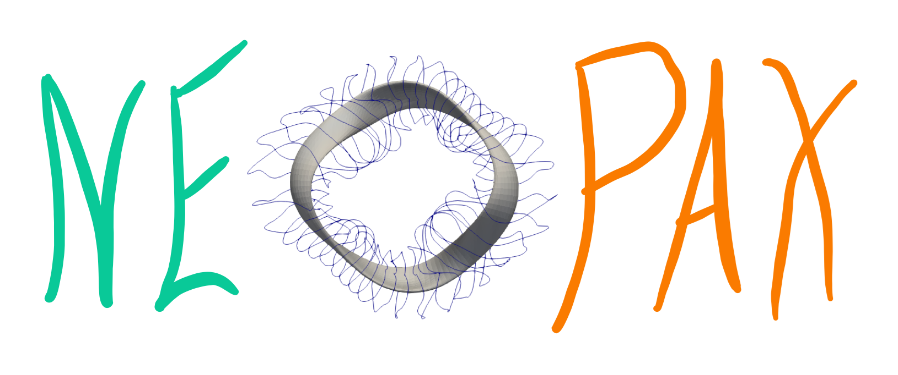

.. NEOPAX documentation master file

.. image:: https://img.shields.io/badge/GitHub-Repository-blue
   :target: https://github.com/uwplasma/NEOPAX
   :alt: GitHub repository
   :width: 100px
   :align: center

-------------------------

NEOPAX documentation
=========================

Welcome to NEOPAX!
This is a Python package in JAX to perform optimization of Neoclassical and 1D transport calculations in JAX

.. toctree::
   :maxdepth: 2
   :caption: Contents:

   overview
   transport_physics_and_flux_models
   solver_backends
   getting_started
   methods_of_use
   custom_models
   input_file_reference
   worked_examples
