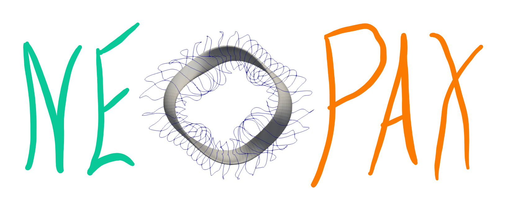

.. NEOPAX documentation master file

.. image:: https://img.shields.io/badge/GitHub-Repository-blue
   :target: https://github.com/uwplasma/NEOPAX
   :alt: GitHub repository
   :width: 100px
   :align: center

-------------------------

NEOPAX documentation
=========================

Welcome to NEOPAX!
This is a Python package in JAX for neoclassical physics, 1D radial transport,
and differentiable transport/geometry workflows.

.. toctree::
   :maxdepth: 2
   :caption: Getting Started

   installation
   quickstart
   dimensional_scaling
   getting_started

.. toctree::
   :maxdepth: 2
   :caption: Tutorials

   tutorials
   worked_examples

.. toctree::
   :maxdepth: 2
   :caption: Theory and Numerics

   theory_and_conventions
   equations_and_derivations
   algorithms
   confinement_physics
   architecture
   mirror_geometry
   transport_physics_and_flux_models
   solver_backends
   expensive_response_methods

.. toctree::
   :maxdepth: 2
   :caption: Reference

   api_reference
   cli_reference
   methods_of_use
   custom_models
   input_file_reference
